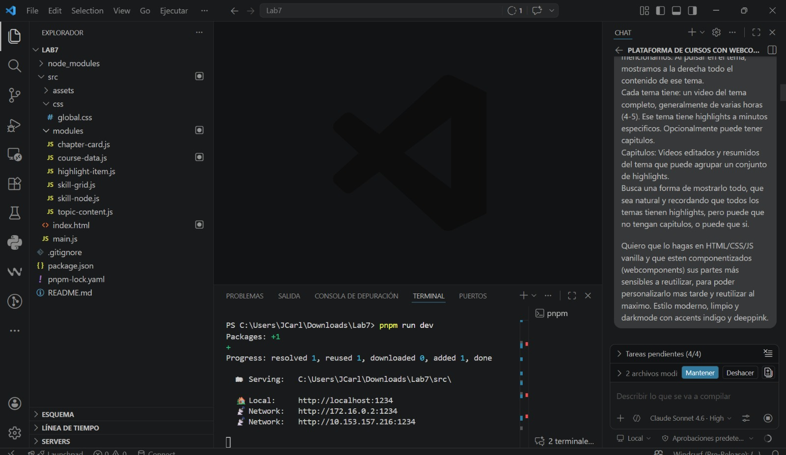
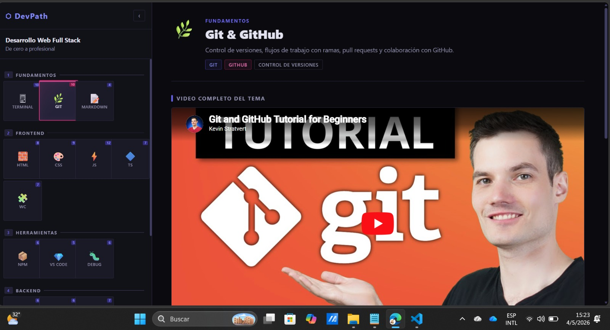
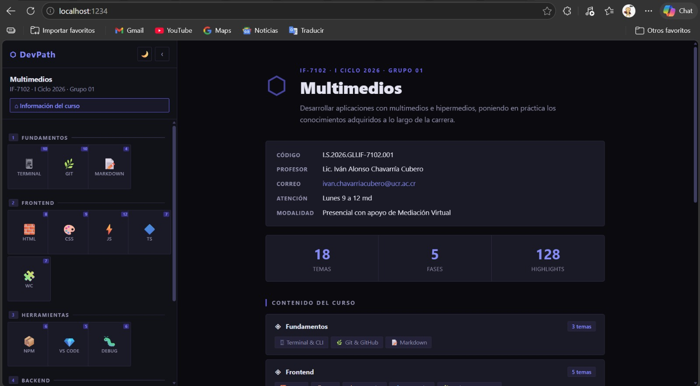

# DevPath — Plataforma de Cursos

Plataforma web para visualizar cursos estructurados en fases y temas, con videos de YouTube, highlights por timestamp y capítulos editados.

## Estructura del proyecto

```
Lab7/
├── src/
│   ├── assets/
│   │   ├── fonts/          # Tipografías locales
│   │   └── images/         # Imágenes estáticas
│   ├── css/
│   │   └── global.css      # Estilos globales (variables, layout, componentes)
│   ├── modules/            # Web Components reutilizables + datos
│   │   ├── skill-node.js       # <skill-node>     — cuadradito de habilidad
│   │   ├── skill-grid.js       # <skill-grid>     — árbol de habilidades (sidebar)
│   │   ├── topic-content.js    # <topic-content>  — panel principal del tema
│   │   ├── highlight-item.js   # <highlight-item> — fila de highlight con timestamp
│   │   ├── chapter-card.js     # <chapter-card>   — tarjeta de capítulo
│   │   └── course-data.js      # Datos del curso (editar aquí)
│   ├── index.html
│   └── main.js             # Lógica principal y navegación
├── .gitignore
├── package.json
└── pnpm-lock.yaml
```

## Inicio rápido

```bash
pnpm install
pnpm dev       # http://localhost:1234
```

## Personalizar el curso

Edita `src/modules/course-data.js`. La estructura de datos es:

```js
{
  name: "Nombre del curso",
  phases: [
    {
      id: "fase-1",
      name: "Nombre de la fase",
      topics: [
        {
          id: "mi-tema",
          name: "Nombre del tema",
          shortName: "Corto",   // texto del cuadradito en el grid
          icon: "⚡",
          description: "Descripción del tema",
          tags: ["Tag1", "Tag2"],
          videoId: "ID_DE_YOUTUBE",
          videoTitle: "Título del video",
          duration: "4h 30m",
          highlights: [
            { seconds: 0,    title: "Título del highlight", desc: "Descripción opcional" },
            { seconds: 1800, title: "Otro highlight" },
          ],
          chapters: [           // opcional — si no hay, deja []
            {
              id: "cap-1",
              title: "Título del capítulo",
              videoId: "ID_DE_YOUTUBE",
              duration: "45:00",
              icon: "📦",
              highlights: [
                { seconds: 0, title: "Highlight del capítulo" }
              ]
            }
          ]
        }
      ]
    }
  ]
}
```

## Web Components

| Componente | Etiqueta | Descripción |
|---|---|---|
| SkillNode | `<skill-node>` | Cuadradito del grid de habilidades |
| SkillGrid | `<skill-grid>` | Grid completo de fases y temas |
| TopicContent | `<topic-content>` | Panel con video, highlights y capítulos |
| HighlightItem | `<highlight-item>` | Fila de highlight con timestamp clickeable |
| ChapterCard | `<chapter-card>` | Tarjeta de capítulo con thumbnail de YouTube |

## Tecnologías

- HTML / CSS / JavaScript vanilla
- Web Components nativos (Custom Elements + Shadow DOM)
- YouTube IFrame API (embed estático, seek por `?start=segundos`)
- `servor` como servidor de desarrollo con live reload

---

## Origen del proyecto — Prompt del Profesor

El proyecto fue generado a partir del siguiente prompt proporcionado por el profesor del curso:

> *Crea una web que va a ser una plataforma de cursos donde voy a añadir videos de youtube que formen parte de un temario. Quiero que a la izquierda aparezca un grid (simulando un árbol de habilidades como el de los videojuegos), pero respecto a los temas del curso y sus secciones... Quiero que las habilidades salgan como cuadraditos o cubos, apilados encima, debajo, o a los lados (Similar al selector de jugadores del street fighter)... Toda esta parte estará en un menú lateral del lado izquierdo de la página. La página principal estará a la derecha, donde aparecerá el contenido seleccionado... Quiero que lo hagas en HTML/CSS/JS vanilla y que estén componentizados (webcomponents) sus partes más sensibles a reutilizar... Estilo moderno, limpio y darkmode con accents indigo y deeppink.*

El prompt completo se encuentra en [`src/docs/PROMP DEL PROFE.txt`](src/docs/PROMP%20DEL%20PROFE.txt).

### Resultado inicial

A partir de ese prompt se construyó la estructura base de la plataforma:

- **Sidebar izquierdo** con un grid de fases y temas al estilo "árbol de habilidades" (cuadraditos compactos, esquinas afiladas, similar al selector de Street Fighter).
- **Panel derecho** con el contenido del tema seleccionado: video principal embebido, highlights por timestamp (clickeables para saltar al minuto exacto) y capítulos opcionales en grid.
- **6 Web Components** con Shadow DOM: `<skill-node>`, `<skill-grid>`, `<topic-content>`, `<highlight-item>`, `<chapter-card>` y `<course-info>`.
- **Dark mode** con variables CSS centralizadas y accents indigo (`#6366f1`) y deeppink (`#ec4899`).

| Prompt del profesor | Resultado en el navegador |
|---|---|
|  |  |

---

## Mejoras propias

Sobre la base generada por el prompt del profesor se aplicaron cuatro mejoras adicionales descritas en [`src/docs/PROMPT PROPIO DE MEJORAS.txt`](src/docs/PROMPT%20PROPIO%20DE%20MEJORAS.txt):

### 1. Componente `<course-info>` — Información del curso

Se creó el Web Component `<course-info>` que reemplaza el panel derecho vacío del estado inicial. Muestra los metadatos del curso (nombre, descripción, código, profesor, correo, horario de atención, modalidad), estadísticas (número de temas, fases y highlights), un resumen visual de las fases con chips de temas, y un CTA para empezar. Recibe los datos vía `el.setCourse(courseData)` sin nada hardcodeado. Se agregó además un botón **"⌂ Información del curso"** en el sidebar para volver a esta vista desde cualquier tema.

### 2. Toggle de modo claro / oscuro

Se añadió un botón `🌙/☀️` en la cabecera del sidebar que alterna entre dark y light mode. El theming se implementa con variables CSS en `:root` (dark por defecto) y el selector `[data-theme="light"]` en `<html>`. La preferencia se persiste en `localStorage` y se respeta `prefers-color-scheme` del sistema en la primera visita. Todos los Web Components heredan las variables correctamente sin sobreescribir nada en sus bloques `:host`.

### 3. Transiciones suaves al cambiar de tema

Al seleccionar un tema, el panel derecho hace un fade-out rápido (150 ms) antes de montar el nuevo contenido, seguido de un fade-in + slide desde abajo (300 ms, `cubic-bezier(0.4, 0, 0.2, 1)`) con stagger escalonado entre bloques: encabezado → video → tabs → panel activo (delays de 0 ms / 60 ms / 120 ms / 180 ms respectivamente). Se respeta `prefers-reduced-motion`.

### 4. Limpieza de código (clean code)

- Archivo `constants.js` con todos los valores mágicos (duraciones, claves de localStorage, nombres de eventos).
- Módulo `theme-manager.js` con responsabilidad única: inicializar, alternar y consultar el tema.
- Listeners de eventos movidos a `connectedCallback` (una sola vez por instancia) en todos los Web Components — eliminando la acumulación de listeners que ocurría al re-renderizar.
- Comunicación entre componentes exclusivamente vía `CustomEvent` con los nombres definidos en `CONSTANTS.EVENTS`.
- Variables CSS hardcodeadas en los bloques `:host` de cada Web Component eliminadas; ahora heredan de `:root` correctamente.

### Resultado con las mejoras aplicadas


